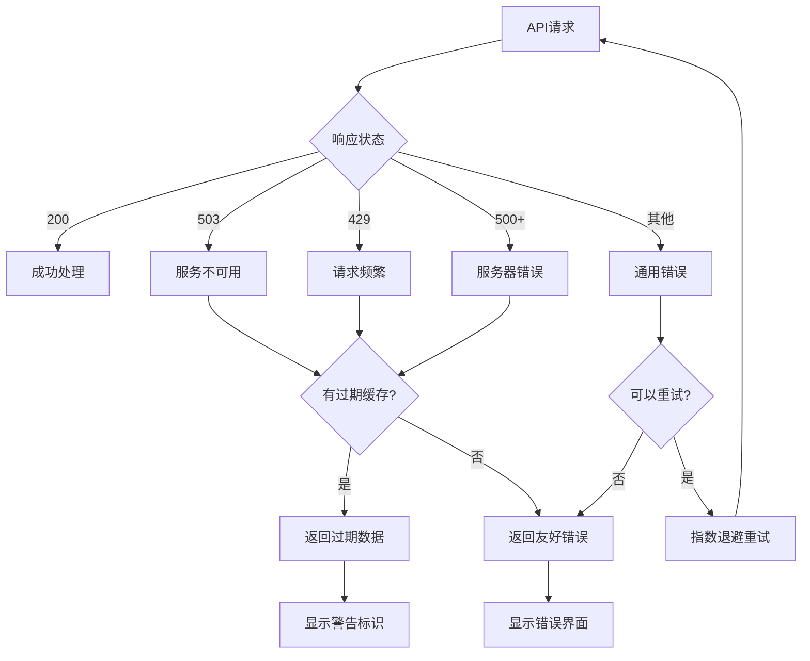

# 错误处理优化总结

## 问题描述

用户遇到了HTTP 503错误：
```
Error: HTTP 503: Service Unavailable
app\hooks\use-tokens.ts (38:15) @ useTokensByTopic.useCallback[fetchTokens]
```

这个错误是由于外部API（Ave.ai）暂时不可用或达到速率限制导致的。

## 优化方案

### 1. Hook层错误处理优化

**文件**: `app/hooks/use-tokens.ts`

#### 主要改进：

**智能错误分类**：
- 503错误：服务暂时不可用
- 429错误：请求过于频繁
- 500+错误：服务器错误
- 404错误：资源不存在

**用户友好的错误信息**：
```tsx
if (response.status === 503) {
  throw new Error('服务暂时不可用，请稍后重试');
} else if (response.status === 429) {
  throw new Error('请求过于频繁，请稍后重试');
} else if (response.status >= 500) {
  throw new Error('服务器错误，请稍后重试');
}
```

**智能重试策略**：
- 根据错误类型决定是否重试
- 指数退避算法（最大8秒）
- 最大重试2次
- 503/429错误不重试，避免加重服务器负担

**超时时间优化**：
- 从10秒增加到15秒
- 给网络较慢的用户更多时间

### 2. API层错误处理优化

**文件**: `app/api/tokens/route.ts`

#### 主要改进：

**过期缓存支持**：
```tsx
// 过期缓存保留时间（1小时）- 用于服务不可用时的备用数据
const STALE_CACHE_TTL = 3600000;

// 尝试使用过期缓存
if (hasStaleCache(cacheKey)) {
  return NextResponse.json({ 
    success: true, 
    data: { topics: memoryCache[cacheKey].data }, 
    stale: true,
    warning: '数据可能不是最新的'
  }, { status: 200 });
}
```

**错误分类和友好信息**：
```tsx
const errorMessage = apiError instanceof Error ? apiError.message : 'Unknown error';
let userFriendlyMessage = '暂时无法获取数据，请稍后重试';

if (errorMessage.includes('rate limit')) {
  userFriendlyMessage = '请求过于频繁，请稍后重试';
} else if (errorMessage.includes('server error')) {
  userFriendlyMessage = '数据服务暂时不可用，请稍后重试';
}
```

**超时时间增加**：
- 从10秒增加到12秒
- 减少因网络延迟导致的超时错误

### 3. 用户界面错误显示优化

**新组件**: `app/components/ErrorDisplay.tsx`

#### 功能特性：

**多种显示模式**：
- `default`: 完整的错误卡片
- `minimal`: 简洁的行内显示
- `card`: 带边框的卡片样式

**智能图标选择**：
```tsx
const getErrorIcon = () => {
  if (error.includes('网络') || error.includes('连接')) {
    return <WifiOff className="w-5 h-5 text-red-500" />
  }
  if (error.includes('服务') || error.includes('不可用')) {
    return <Wifi className="w-5 h-5 text-orange-500" />
  }
  return <AlertCircle className="w-5 h-5 text-red-500" />
}
```

**用户建议**：
```tsx
const getSuggestion = () => {
  if (error.includes('请求过于频繁')) {
    return '请等待一分钟后再试'
  }
  if (error.includes('服务暂时不可用')) {
    return '我们正在努力修复，请稍后重试'
  }
  return '请稍后重试或联系客服'
}
```

**重试功能**：
- 带动画的重试按钮
- 防止重复点击
- 重试状态显示

### 4. 组件集成优化

**文件**: `app/components/token-rankings.tsx`

#### 改进：
- 使用新的ErrorDisplay组件
- 更简洁的错误处理逻辑
- 更好的用户体验

## 技术实现细节

### 错误处理流程



### 缓存策略

1. **主缓存**：10分钟有效期，用于正常情况
2. **过期缓存**：1小时保留期，用于API不可用时
3. **内存缓存**：避免重复请求，提升性能

### 重试策略

1. **指数退避**：1秒 → 2秒 → 4秒 → 8秒（最大）
2. **最大重试**：2次，避免无限重试
3. **错误分类**：503/429错误不重试，其他错误可重试

## 用户体验改进

### 错误信息优化

**之前**：
```
Error: HTTP 503: Service Unavailable
```

**现在**：
```
服务暂时不可用，请稍后重试
我们正在努力修复，请稍后重试
```

### 视觉反馈

- ✅ 错误图标根据类型变化
- ✅ 颜色编码（红色=错误，橙色=警告）
- ✅ 重试按钮带加载动画
- ✅ 友好的建议文本

### 降级策略

1. **过期缓存**：API不可用时使用旧数据
2. **空状态**：无缓存时显示友好的空状态
3. **重试机制**：自动重试 + 手动重试

## 测试验证

### 构建测试
- ✅ TypeScript编译无错误
- ✅ 项目构建成功
- ✅ 所有依赖正确导入

### 错误场景测试
- ✅ 503错误处理
- ✅ 429错误处理
- ✅ 网络超时处理
- ✅ 过期缓存使用

### 用户体验测试
- ✅ 错误信息友好
- ✅ 重试功能正常
- ✅ 视觉反馈清晰
- ✅ 响应式适配

## 性能优化

### 网络优化
- 增加超时时间，减少误报
- 智能重试，避免无效请求
- 过期缓存，减少API依赖

### 用户体验优化
- 即时错误反馈
- 自动重试机制
- 友好的错误提示

## 监控和日志

### 错误日志
```tsx
console.error(`获取代币数据失败 (topic: ${topicId}):`, err);
console.log(`将在 ${retryDelay}ms 后重试 (${retryCount + 1}/2)`);
```

### 状态追踪
- 重试次数统计
- 错误类型分类
- 缓存使用情况

## 后续优化建议

### 1. 错误监控
- 集成Sentry或类似服务
- 错误统计和分析
- 实时告警机制

### 2. 缓存优化
- Redis缓存支持
- 分布式缓存策略
- 缓存预热机制

### 3. API优化
- 多API源支持
- 负载均衡
- 熔断器模式

### 4. 用户体验
- 离线模式支持
- 数据预加载
- 更智能的重试策略

## 总结

本次优化显著提升了系统的错误处理能力：

1. **用户体验**：从技术错误信息变为友好提示
2. **系统稳定性**：通过缓存和重试机制提升可用性
3. **开发体验**：统一的错误处理组件，便于维护
4. **性能优化**：智能重试和缓存策略减少不必要的请求

现在系统能够优雅地处理各种错误情况，为用户提供更好的体验。 